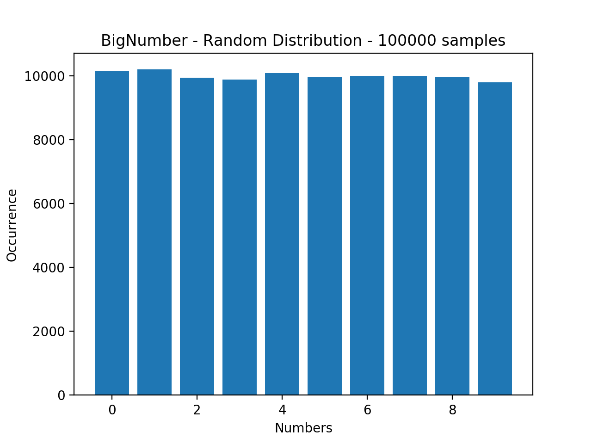

# BigNumber

Overcome the integer limit.

WARNING: This lib is a work in progress made by an amateur in C++, and is probably not production ready. It was created as a personal project, mainly as a learning experience. This project is here pubished just in case anyone find any use out of it, or maybe want to learn with it.  


#### Contents

* [Info](#Info)
* [Usage](#Usage)
* [Overview](#Overview)
* [Contributing](#Contributing)
* [License](#License)


## Info
BigNumber is a header only library for working with integers values bigger than the hardware limit.  
BigNumber has no addition dependencies and is as simple to use as possible.  

## Usage
#### Installing
Installation is very simple, just download and copy the [BigNumber header](include/BigNumber.h) to your project.  
Then, you can simply include in other files:
```c++
#include "BigNumber.h"
```
or
```c++
#include "<some_folder>/BigNumber.h"
```
depending where you put the file.  

#### Overview
For simplicity reasons, this overview will use `using pr0crustes::BigNumber;`. If you prefer not to do so, you can access the BigNumber class as `pr0crustes::BigNumber`.  

###### Instantiation
It is possible to instantiate a BigNumber in multiple ways:  
```c++
BigNumber A;  // will hold the value 0.
BigNumber B(100);  // B will hold the value 100.
BigNumber C(-50);  // C will hold the value -50.
BigNumber D("-4561273837128312881");  // D will hold the value -4561273837128312881.
BigNumber E = "4561273837";  // E will hold the value 4561273837
BigNumber F = 2;  // F will hold the value 2.
```

###### Operators
The BigNumber class overload the following operators: `+`, `-`, `*`, `/`, `%`.  
Overloading these ones, others operators like `+=`, `-=`, `*=`, `/=`, `%=`, `++`, `--`, `-` reuse the previous ones to also work.  

```c++
BigNumber a("1390824942691875931654");
BigNumber b("373294235818098884803");

std::cout << (a + b) << std::endl;
// Output: 1764119178509974816457

std::cout << (a - b) << std::endl;
// Output: 1017530706873777046851

std::cout << (a * b) << std::endl;
// Output: 519186934138915001194112299224174047254162

std::cout << (a / b) << std::endl;
// Output: 3	(Divison ouput is rounded down)

std::cout << (a % b) << std::endl;
// Output: 270942235237579277245
```
Relational operators, like `>`, `>=`, `<`, `<=`, `==`, `!=` are also overloaded.  
##### Interface
* A BigNumber instance is printable, overloading `<<`, but you can also get it's std::string representation by calling `.asString()` in an instance.  
* Use `.absoluteValue()` to get a NEW instance of BigNumber with the absolute value of the instance called on.  
* Use `.asBinary()` to get a binary representation of the BigNumber. The first Bit indicates if it is negative or not.  
* Use `.asLongLong()` to get the value of an instance as a long long.  
* Use `.divide10(int N)` to quickly divide a bignumber by 10, N times.
* Use `.fitsInLongLong()` to check if an instance can be safelly converted to a long long.  
* Use `.fromBinary(std::string binary, bool isSigned)` (static) to create a new instance from a binary string. By default, the first bit will be interpreted as a negative indicator. To supress it, pass `false` to the `isSigned` arg.  
* Use `.isOdd()` or `.isEven()` to check if an instance is Odd or Even.  
* Use `.isPositive()` to check if an instance is positive or not.  
* Use `.isOne()` to check if an instance is one (positive), faster than comparing to another object.  
* Use `.isZero()` to check if an instance is zero, faster than comparing to another object.  
* Use `.lenght()` to get the count of how many digits an instance has.  
* Use `.modPow(BigNumber p, BigNumber m)` to get the result of the module `m` of the instance to the power of `p`, this is (instance ^ p) % m. This is way faster than `.pow()` and should be used intead of doing `instance.pow(p) % m`.  
* Use `.pow(BigNumber N)` to get the result of the instance to the `n` power. This operation is expensive and can take a while with larger `N`s. Use `.modPow()` if possible.  
* Use `.times10(int N)` to get a the result of the instace times 10 to the power of `N`, basically multiplying by 10 `N` times. This is faster than multiplying by 10.  

* Use `BigNumber::randomBigNumber(int l)` (static) to get a random BigNumber instance with  `l` digits. THIS USES A PSEUDO-RANDOM FUNCTION. DO NOT RELY IN IT BEING COMPLETELY RANDOM.  
* Use `BigNumber::randomBigNumberInRange(BigNumber l, BigNumber h)` (static) to get a random BigNumber instance that will be `>= l` and `< h`. THIS USES A PSEUDO-RANDOM FUNCTION. DO NOT RELY IN IT BEING COMPLETELY RANDOM.  

###### Randomness
All random functions are pseudo-random function.  
Do not rely in it being completely random.  
Although, using pseudo generation, the results seens to be uniform, as shows the graph.  

  
##### Warning
A few methods will throw exceptions of type `std::invalid_argument` in case an invalid operation is attempted, like instantiating a BigNumber from a non-number string, dividing by 0, module operation by 0.  
A few methods that do not support negative numbers will also throw exceptions when called with a negative number. This includes `pow` and `mowPow` with negative arguments.  
Since this lib is open source, it is recommended that you read the comment above a method defition _before_ using it in your code.  

## Contributing
Contributions are welcome, fork this repo, change it, open a pull request or an issue.  
Make sure no tests are failing.  

## License
All code is licensed under [MIT](LICENSE).  
*THE SOFTWARE IS PROVIDED "AS IS", WITHOUT WARRANTY OF ANY KIND.*

